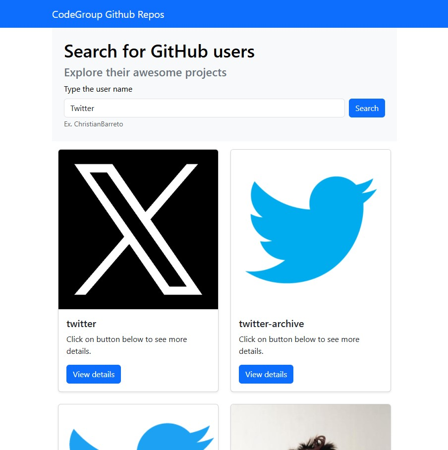

# Codegroup GitHub Repos

This project aims to use the GitHub api to fetch and search users and repos.

;

## Deploy
This project is deployed on Vercel on the following url:

[Codegroup GitHub repos](https://codegroup-github-repos.vercel.app/)

## How to run locally

Clone this repository 

`$ git clone git@github.com:ChristianBarreto/codegroup-github-repos.git`

Go to directory

`$ cd codegroup-github-repos`

Install dependencies

`$ npm install`

Execute the React application

`$ npm start`